# Optimization based Biped Jump with uncertainties  
## Authors: Dhruv Parikh, Anirudh Kailaje
|                          |                          |                          |                          
| ------------------------------- | ------------------------------- | ------------------------------- | 
| 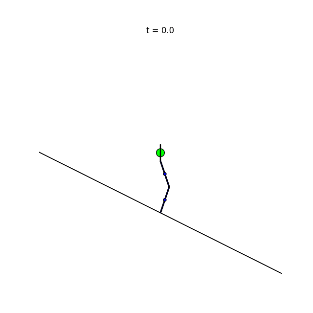 | 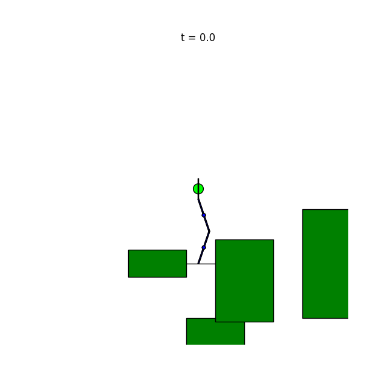 | 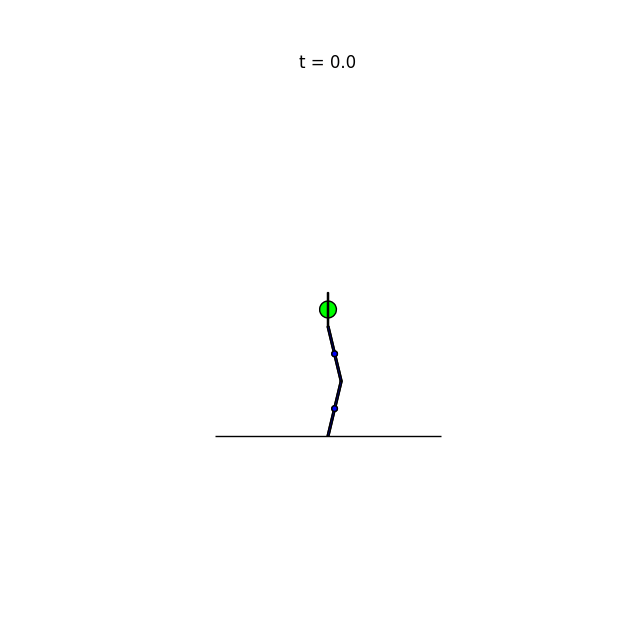 |

We present a 3-phase hybrid controller that jumps to a required height. The launch trajectory is obtained through contact implicit Direct Collocation, a mathematical program with complimentary constraints (MPCC). The trajectory is followed by an Operational Space Controller (OSC). Separate OSCs were made for the flight and landing phases. The controller we made is robust against a wide range of system mass fluctuations, state estimation errors, and terrain geometry. The controller works for a range of jump height requirements for a given system mass distribution, estimation error, and terrain. It is sensitive to low coefficient of friction, solver parameters, and phase switch error when direct collocation fails.

## Results

|                          |                          |                          |                          |
| ------------------------------- | ------------------------------- | ------------------------------- | ------------------------------- |
| 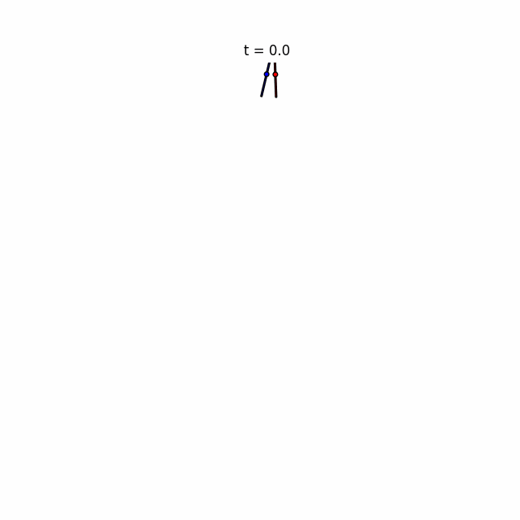 | 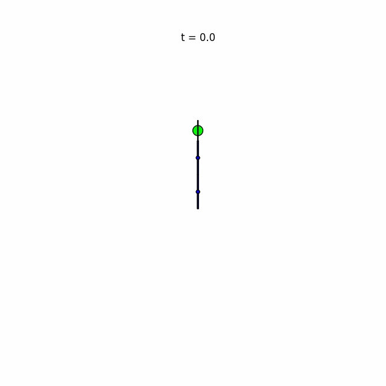 | 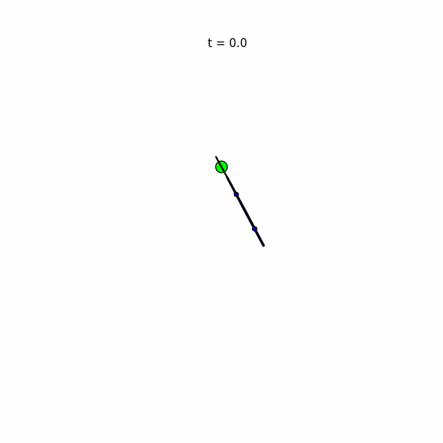 | 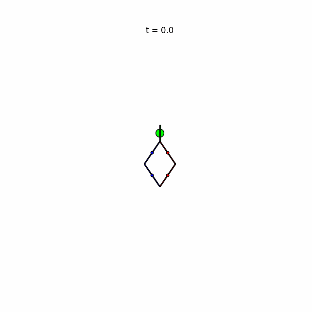 |
|  | 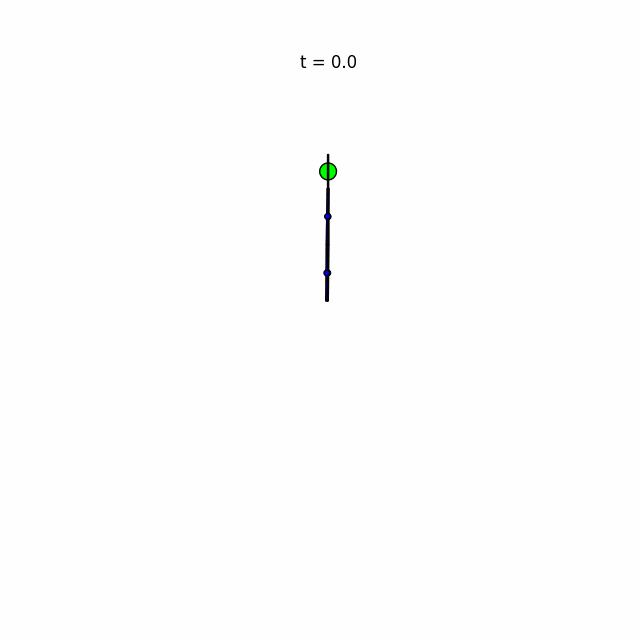 | 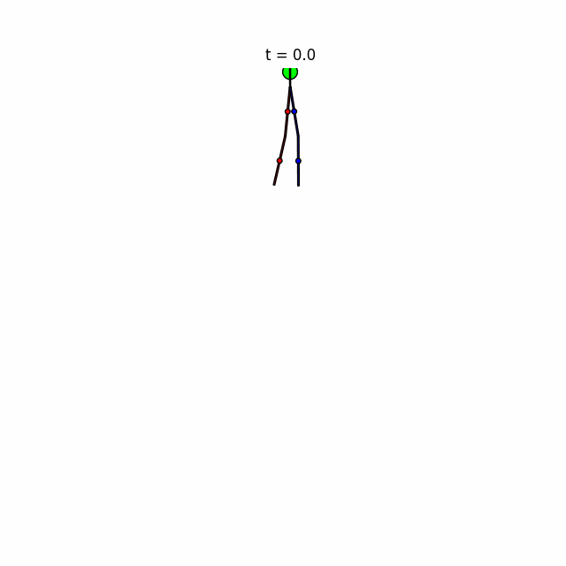 | 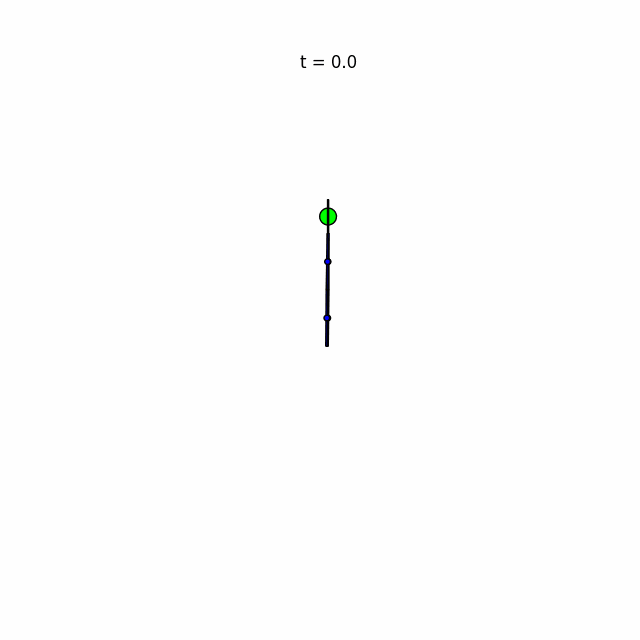 |
| 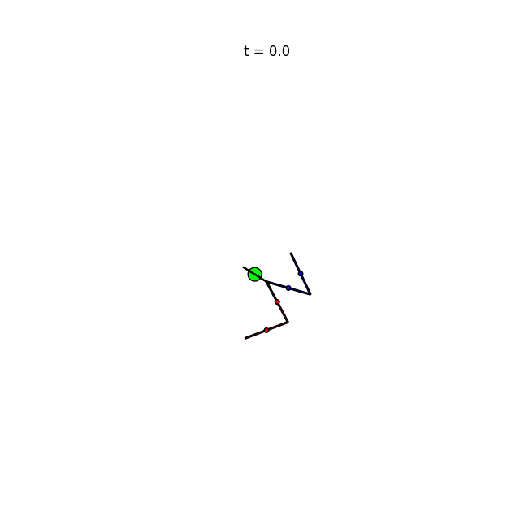 |  | 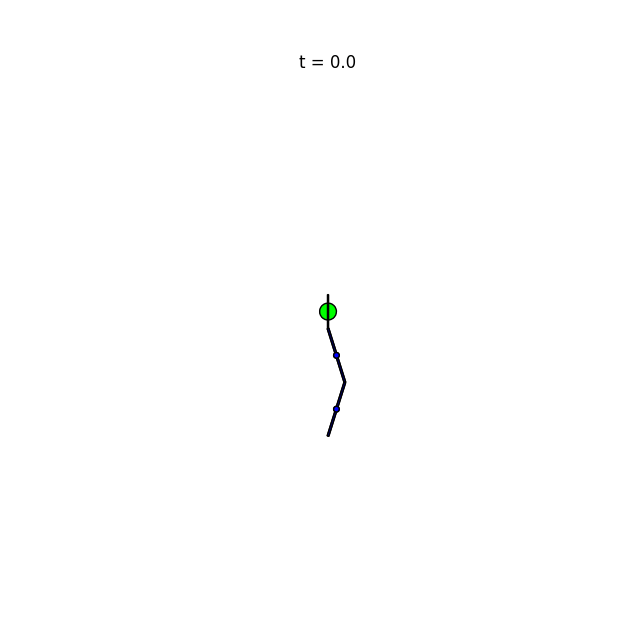 |  |
|  | 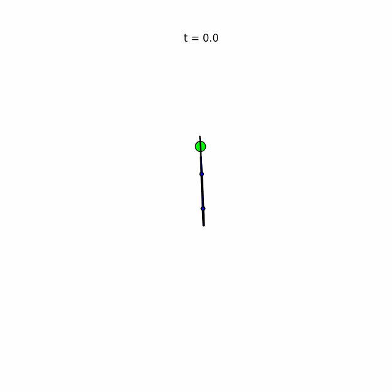 |  |  |


## Key Findings

Our controller demonstrates the following key findings:

- The controller works effectively for a family of jump heights, considering various terrains characterized by factors like slope and coefficient of friction ($\mu$).
- It exhibits stability across a wide range of slopes, and it can stabilize post-landing without requiring adjustments.

## Experimentation Observations

During experimentation, we observed challenges that warrant careful examination in future work:

1. **Direct Collocation**
    - Very sensitive to solver settings.
    - Lower-cost "solutions" may result in infeasible trajectories.

2. **Phase Switch Robustness**
    - Consider exploring the use of contact forces for a more robust phase switch.

3. **Optimal Control with Slip**
    - Introduce complementary constraints in Optimal Control with Slip (OSC) to facilitate slip in the system.

These observations provide valuable insights for further investigation and improvement of the controller.


## Setup
Supported OS: Ubuntu 22.04 

```
mkdir venv
python -m venv venv
venv\Scripts\activate
pip install -r requirements.txt
```

## License
Copyright <2023>

Permission is hereby granted, free of charge, to any person obtaining a copy of this software and associated documentation files (the “Software”), to deal in the Software without restriction, including without limitation the rights to use, copy, modify, merge, publish, distribute, sublicense, and/or sell copies of the Software, and to permit persons to whom the Software is furnished to do so, subject to the following conditions:

The above copyright notice and this permission notice shall be included in all copies or substantial portions of the Software.

THE SOFTWARE IS PROVIDED “AS IS”, WITHOUT WARRANTY OF ANY KIND, EXPRESS OR IMPLIED, INCLUDING BUT NOT LIMITED TO THE WARRANTIES OF MERCHANTABILITY, FITNESS FOR A PARTICULAR PURPOSE AND NONINFRINGEMENT. IN NO EVENT SHALL THE AUTHORS OR COPYRIGHT HOLDERS BE LIABLE FOR ANY CLAIM, DAMAGES OR OTHER LIABILITY, WHETHER IN AN ACTION OF CONTRACT, TORT OR OTHERWISE, ARISING FROM, OUT OF OR IN CONNECTION WITH THE SOFTWARE OR THE USE OR OTHER DEALINGS IN THE SOFTWARE.

